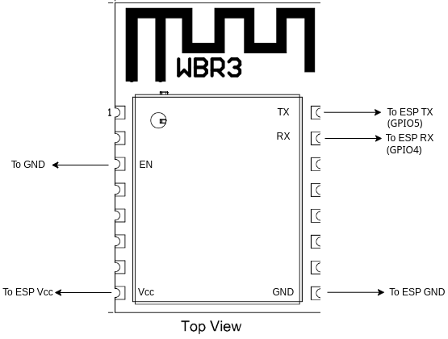

# Poolex Heat Pump WiFi remote control
Poolex is a line of heat pumps manufactured by a French company Poolstar. This repository describes an easy method how to control this heatpump with ESP8266/32 modules flashed with ESPHome and Home Assistant.

## Motivation
The main motivation behind this project is a lack of flow detection in this heat pump. Previous heat pump I had was able to go to the stand-by mode when no water flow was detected (pool pump turned off). However, this heat pump only goes to "Error 13" and disables itself until a restart, which was quite annoying. A simple solution was to turn off and on the heat pump with a WiFi socket, but I did want to turn off the heat pump properly, not just by "pulling the plug". 

For many reasons, I like to control IoT devices locally, without a need of exposing the devices to some public cloud. This led me to modifying the main control board with ESP8266 to connect the pump to my Home Assistant instance and turn the pump on only when the pool pump is on as well.

## Intro
These heat pumps are controlled by a remote controller based on an unkown microcontroller by STMicroelectronics. This remote controller communicates with the heat pump via a RS485-based serial protocol. There is also another microcontroller present onboard -- Tuya WBR3. This WiFi module communicates with the main microcontroller via Tuya MCU protocol. See following diagram.

Tuya WBR3 allows heat pump to be connected to the Tuya Cloud and thus controlled via Internet with Tuya or Smart Life apps. However, you usually do not want to connect such an expensive equipment to some doubtful cloud. Also, Tuya modules are not of a best quality. There are two methods how to retain WiFi functionality without using the Tuya Cloud and WBR3 module altogether.

## Method I
You can bypass the main microcontroller and communicate with the heat pump directly. This allows you to get every parameter including service data. However, you will need RS485 voltage converters and there may be greater risk of damaging the heat pump. This method is described in another project [here](https://github.com/cribskip/esp8266_poolstar).

## Method II (this guide)
Main microcontoller communicates with the WBR3 using UART-based Tuya MCU protocol. This protocol is supported by the ESPHome firmware for ESP8266/32 devices, so WBR3 can be disabled and replaced with ESPHome-flashed ESP8266/32 to connect our heat pump to Home Assistant. This method requires only ESP8266/32, because both ESP and WBR3 operates on 3.3V (voltage regulator is already present on remote controller) and UART is (obviously) supported by the ESP modules.

### Features
This method allows you to:
- Turn the heat pump on and off.
- Check the pool temperature.
- Set the required temperature.
- Set the required mode (heat/cool/automatic and eco/boost/silent).

### Flashing the ESP
1. Prepare an ESP module and connect the module to the computer.
2. Download the `esphome_poolex.yaml` file provided in this repository and edit to your needs (at least you need to change fields marked with `EDIT_ME` -- names and passwords).
3. Compile and flash this file using the `esphome` tool (check [official guide](https://esphome.io/)).

### Replacing the WBR3 with ESP
Prepare a pinout of your ESP module, different versions have different pinouts. These can be easily found on Google. WBR3 pinout is attached below or can be found in [official docs](https://developer.tuya.com/en/docs/iot/wbr3-module-datasheet?id=K9dujs2k5nriy).

At first, disconnect the heat pump from the power outlet. Wait until the display turns off and then disconnect the remote controller from the heat pump. Remove the back cover of the remote controller.

Now you will need to disable or remove the WBR3 module completely. I do not recommend to remove the module, you risk damaging the LCD. The WBR3 can be easily disabled by pulling the EN pin low (see attached diagram for pinout). So, to disable the WBR3, connect the EN pin to GND using a wire. *Important: you **need** to disable (or remove) the WBR3, otherwise the serial communication will not work and you will probably overload the onboard AMS1117 regulator.*

Now, connect the TX pin of the WBR3 to the pin of the ESP you configured as TX and same for the RX pin. In the configuration I used GPIO4 as RX and GPIO5 as TX but you can change it to any other available GPIO or you can use hardware UART (GPIO1 and GPIO3) -- but then you need to either disable UART logging or move logging to another UART.

*Note: the WBR3 is disabled, we will obviously communicate with the main MCU directly, we are soldering to the pins of the WBR3 only for convenience.*

At last, connect the ESP module to the Vcc and GND, see the picture and diagram below for the pin locations.

Put back the cover, connect the controller to the heat pump and you are ready to go!

#### Circuit board overview

#### Connection diagram

## Summary
After powering on the heat pump, the ESP should connect to your home network and you should be able to add the device to your Home Assistant instance. Now you have bypassed the Tuya cloud and you can control the heat pump fully locally!

